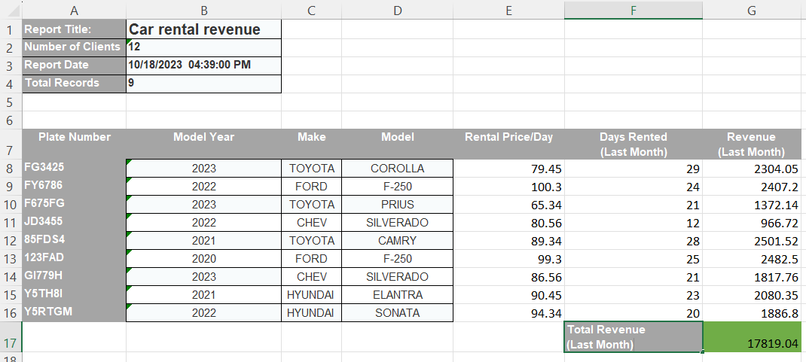

# Object Poi
It is a library built on top of Apache POI with the goal of creating an Object Excel Mapping library designed to simplify the process of parsing intricate Excel documents into objects.

## Getting Started

### Gradle:
```
implementation 'com.pcistudio:object-poi:${latestVersion}'
```

### Maven:
```xml
<dependency>
    <groupId>com.pcistudio</groupId>
    <artifact>object-poi</artifact>
    <version>${latestVersion}</version>
</dependency>
```
## Overview
In Object Poi we treat every sheet as a group of sections, and the sections as a list of rows. For the sections we have 2 types:
 `table` when the columns are in a row. Example:

    | columnName1 | columnName1 |
    |-------------|-------------|
    | value1      | value2      |
    | value3      | value4      |
2. `pivot` when the columns are vertical in a single column. Example:

    | columnName1 | value1 | value4 |
    |-------------|--------|--------|
    | columnName2 | value2 | value5 |
    | columnName3 | value3 | value6 |

Every sheet represent an object that contain one list for each section in that sheet. Each section represent a list of objects.




Is better use the startName
because the startIndex will get mess up if there is empty 
rows

## Example
First extends `ColumnSheetParser<T>` with the type of object present in the Excel sheet. Complex Excel sheets are compose by sections which will need to be described.
In this example the current sheet is having 3 sections:
1. Pivot table Header of type `keyValue` starting at index 0.
2. Normal table with name MainTable starting at index 9 with the column name row.
3. Last section start when the start value `Count:` is found, I this case  the section will be ignored because `objectToBuild=null`. Useful in case that you want to skip the section.
```java
public class ReportColumnSheetParser extends ColumnSheetParser<Report> {

    @Override
    protected void describeSections(Report report, SectionParserManagerBuilder builder) {
        builder.<ReportHeader>pivot(config -> config
                        .name("Header")
                        .objectToBuild(report.getHeader())
                        .keyValue()
                        .rowStartIndex(0))
                .<InventoryRow>table(config -> config.name("MainTable")
                        .recordClass(RowObject.class)
                        .objectToBuild(report.getRowObjects())
                        .rowStartIndex(9))
                .pivot(config -> config.name("Header")
                        .objectToBuild(null)
                        .keyValue()
                        .startName("Count:"));
    }

    @Override
    public String getSheetName() {
        return "Report";
    }
}
```

```java
import com.pcistudio.poi.processor.WorkbookProcessor;
...
public static void main(String[]args){
        WorkbookProcessor workbookProcessor = new WorkbookProcessor(dataSheetParser());
}

```